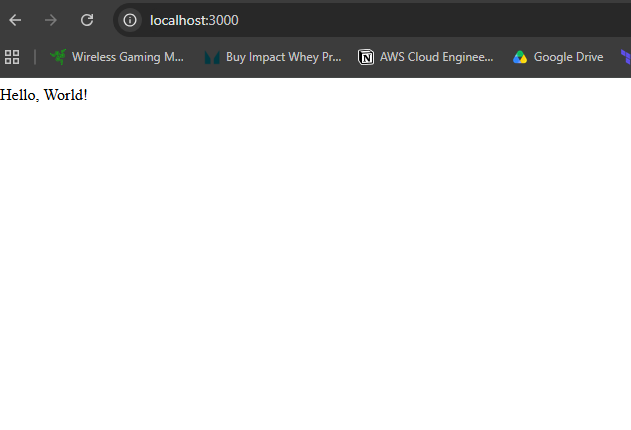
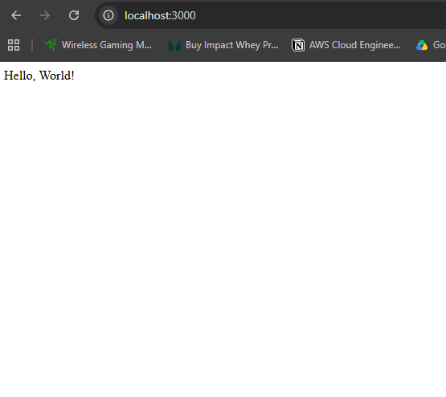
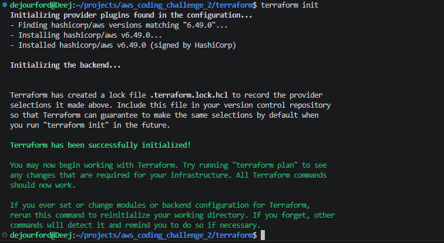
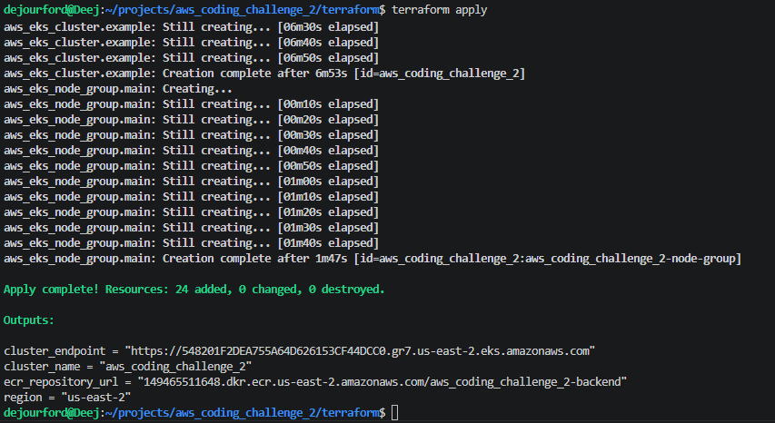

# Tech Challenge 2

## Objective
Deploy a web application using **Docker**, orchestrate it with **AWS EKS**, and set up a **continuous deployment pipeline** using **Jenkins**.

## Tools Used
- **Node.js / Express** — simple web application serving "Hello, World!"
- **Docker** — containerizing the application and its dependencies
- **Amazon ECR** — storing and versioning Docker images
- **Terraform** — provisioning AWS infrastructure (EKS cluster, VPC, ALB, IAM roles)
- **AWS EKS** — orchestrating containers using Kubernetes with Fargate/EC2 nodes
- **Helm** — packaging and deploying the application to Kubernetes
- **Jenkins** — CI/CD pipeline for building, pushing, and deploying the application
- **kubectl** — interacting with the EKS cluster from Jenkins
- **HPA (Horizontal Pod Autoscaler)** — scaling pods based on CPU/memory utilization
- **ALB (Application Load Balancer)** — routing public traffic to the EKS cluster
- **GitHub** — version control and webhook integration with Jenkins
- **GitHub Actions** — GitOps bonus CI pipeline (build + push to ECR)
- **ArgoCD** — GitOps bonus CD, syncing Helm charts to EKS automatically

## Procedure

### Phase 1 - Creating the Web Application

Step 1.1 - Create a directory named 'backend' and navigate into it

```
mkdir backend && cd backend
```

Step 1.2 - Initialize the Node project

```
npm init -y
```


Step 1.3 - Install Node.js, npm, and Express

```
sudo apt install nodejs npm -y
npm install express
```

Step 1.4 - Verify Installation

```
node -v
ls node_modules | grep express
```

Step 1.5 - Create a .gitignore file in the project root and add the following code snippet
```
node_modules
.env
npm-debug.log
.terraform/
.terraform.lock.hcl
*.tfstate
*.tfstate.backup
*.tfstate.lock.info
*.pem
```

Step 1.6 - Create index.js and write the web application
```
const express = require('express')
const app = express()
const PORT = 3000

app.get('/', (req, res) => {
  res.send('Hello, World!')
})

app.listen(PORT, () => {
  console.log(`Server running on port ${PORT}`)
})
```


Step 1.7 - Run the web application

```
node index.js
```

Step 1.8 - Navigate to localhost:3000 in the web browser and you should see the "Hello, World!" text




### Phase 2 - Containerize the application with Docker

Step 2.1 - Install Docker

```
sudo apt install docker.io -y
sudo systemctl start docker
sudo systemctl enable docker
sudo usermod -aG docker $USER
```

Step 2.2 - Create a Dockerfile in the backend directory and add the code snippet below
```
FROM node:18
WORKDIR /app
COPY package*.json ./
RUN npm install
COPY . .
EXPOSE 3000
CMD ["node", "index.js"]

```

Step 2.3 - Build the Docker image
```
docker build -t backend-app .
```

Step 2.4 - Run the container and navigate to localhost:3000 to verify that "Hello World!" is still displayed.
```
sudo docker run -d --name backend -p 3000:3000 backend-app
```



### Phase 3 - Provision Infrastructure with Terraform

Step 3.1 - Create a Terraform directory in the project root
```
mkdir terraform && cd terraform
touch provider.tf ecr.tf eks.tf variables.tf outputs.tf vpc.tf iam.tf
```

Step 3.2 - Add the provider resource block to the provider.tf file
```
terraform {
  required_providers {
    aws = {
      source  = "hashicorp/aws"
      version = "6.49.0"
    }
  }
}

provider "aws" {
  # Configuration options
  region = var.region
}
```

Step 3.3 - Add the following code snippet to the vpc.tf file
```
#------------------------------------------------------------------
# VPC
#------------------------------------------------------------------
resource "aws_vpc" "main" {
  cidr_block           = var.vpc_cidr
  enable_dns_hostnames = true
  enable_dns_support   = true

  tags = {
    Name        = "${var.project_name}-vpc"
    Environment = var.environment
  }
}

#------------------------------------------------------------------
# Public subnets
#------------------------------------------------------------------
resource "aws_subnet" "public" {
  count             = 2
  vpc_id            = aws_vpc.main.id
  cidr_block        = cidrsubnet(var.vpc_cidr, 8, count.index)
  availability_zone = count.index == 0 ? "us-east-2a" : "us-east-2b"

  map_public_ip_on_launch = true

  tags = {
    Name                                        = "${var.project_name}-public-subnet-${count.index + 1}"
    Environment                                 = var.environment
    "kubernetes.io/cluster/${var.project_name}" = "shared"
    "kubernetes.io/role/elb"                    = "1"
  }
}

#------------------------------------------------------------------
# Private subnets
#------------------------------------------------------------------
resource "aws_subnet" "private" {
  count             = 2
  vpc_id            = aws_vpc.main.id
  cidr_block        = cidrsubnet(var.vpc_cidr, 8, count.index + 2)
  availability_zone = count.index == 0 ? "us-east-2a" : "us-east-2b"

  tags = {
    Name                                        = "${var.project_name}-private-subnet-${count.index + 1}"
    Environment                                 = var.environment
    "kubernetes.io/cluster/${var.project_name}" = "shared"
    "kubernetes.io/role/internal-elb"           = "1"
  }
}

#------------------------------------------------------------------
# Internet Gateway
#------------------------------------------------------------------
resource "aws_internet_gateway" "main" {
  vpc_id = aws_vpc.main.id

  tags = {
    Name        = "${var.project_name}-igw"
    Environment = var.environment
  }
}

#------------------------------------------------------------------
# NAT Gateway
#------------------------------------------------------------------
resource "aws_eip" "nat" {
  domain = "vpc"
  tags = {
    Name        = "${var.project_name}-nat-eip"
    Environment = var.environment
  }
}

resource "aws_nat_gateway" "main" {
  allocation_id = aws_eip.nat.id
  subnet_id     = aws_subnet.public[0].id

  tags = {
    Name        = "${var.project_name}-nat-gateway"
    Environment = var.environment
  }

  depends_on = [aws_internet_gateway.main]
}

#------------------------------------------------------------------
# Route Tables
#------------------------------------------------------------------
resource "aws_route_table" "public" {
  vpc_id = aws_vpc.main.id

  route {
    cidr_block = "0.0.0.0/0"
    gateway_id = aws_internet_gateway.main.id
  }

  tags = {
    Name        = "${var.project_name}-public-rt"
    Environment = var.environment
  }
}

resource "aws_route_table" "private" {
  vpc_id = aws_vpc.main.id

  route {
    cidr_block     = "0.0.0.0/0"
    nat_gateway_id = aws_nat_gateway.main.id
  }

  tags = {
    Name        = "${var.project_name}-private-rt"
    Environment = var.environment
  }
}

#------------------------------------------------------------------
# Route Table Associations
#------------------------------------------------------------------
resource "aws_route_table_association" "public" {
  count          = 2
  subnet_id      = aws_subnet.public[count.index].id
  route_table_id = aws_route_table.public.id
}

resource "aws_route_table_association" "private" {
  count          = 2
  subnet_id      = aws_subnet.private[count.index].id
  route_table_id = aws_route_table.private.id
}

```

Step 3.4 - Add the following code snippet to the eks.tf file
```
#------------------------------------------------------------------
# EKS NODE GROUP
#------------------------------------------------------------------

resource "aws_eks_node_group" "main" {
  cluster_name    = aws_eks_cluster.example.name
  node_group_name = "${var.project_name}-node-group"
  node_role_arn   = aws_iam_role.node.arn
  subnet_ids      = aws_subnet.private[*].id
  instance_types  = [var.instance_type]

  scaling_config {
    desired_size = 1
    min_size     = 1
    max_size     = 4
  }

  depends_on = [
    aws_iam_role_policy_attachment.node_AmazonEKSWorkerNodePolicy,
    aws_iam_role_policy_attachment.node_AmazonEKS_CNI_Policy,
    aws_iam_role_policy_attachment.node_AmazonEC2ContainerRegistryReadOnly,
  ]

  tags = {
    Name        = "${var.project_name}-node-group"
    Environment = var.environment
  }
}

#------------------------------------------------------------------
# EKS 
#------------------------------------------------------------------
resource "aws_eks_cluster" "example" {
  name = var.project_name

  access_config {
    authentication_mode = "API"
  }

  role_arn = aws_iam_role.cluster.arn
  version  = "1.35"

  vpc_config {
    subnet_ids = concat(
      aws_subnet.private[*].id,
      aws_subnet.public[*].id
    )
  }

  # Ensure that IAM Role permissions are created before and deleted
  # after EKS Cluster handling. Otherwise, EKS will not be able to
  # properly delete EKS managed EC2 infrastructure such as Security Groups.
  depends_on = [
    aws_iam_role_policy_attachment.cluster_AmazonEKSClusterPolicy,
  ]

  tags = {
    Name        = "${var.project_name}-eks-cluster"
    Environment = var.environment
  }
}

```

Step 3.5 - Add the following code snippet to the iam.tf file
```
#------------------------------------------------------------------
# IAM 
#------------------------------------------------------------------
resource "aws_iam_role" "cluster" {
  name = "${var.project_name}-cluster-role"
  assume_role_policy = jsonencode({
    Version = "2012-10-17"
    Statement = [
      {
        Action = [
          "sts:AssumeRole",
          "sts:TagSession"
        ]
        Effect = "Allow"
        Principal = {
          Service = "eks.amazonaws.com"
        }
      },
    ]
  })
}

resource "aws_iam_role_policy_attachment" "cluster_AmazonEKSClusterPolicy" {
  policy_arn = "arn:aws:iam::aws:policy/AmazonEKSClusterPolicy"
  role       = aws_iam_role.cluster.name
}

#------------------------------------------------------------------
# IAM Node Group Role
#------------------------------------------------------------------
resource "aws_iam_role" "node" {
  name = "${var.project_name}-node-role"

  assume_role_policy = jsonencode({
    Version = "2012-10-17"
    Statement = [
      {
        Action = "sts:AssumeRole"
        Effect = "Allow"
        Principal = {
          Service = "ec2.amazonaws.com"
        }
      }
    ]
  })
}

resource "aws_iam_role_policy_attachment" "node_AmazonEKSWorkerNodePolicy" {
  policy_arn = "arn:aws:iam::aws:policy/AmazonEKSWorkerNodePolicy"
  role       = aws_iam_role.node.name
}

resource "aws_iam_role_policy_attachment" "node_AmazonEKS_CNI_Policy" {
  policy_arn = "arn:aws:iam::aws:policy/AmazonEKS_CNI_Policy"
  role       = aws_iam_role.node.name
}

resource "aws_iam_role_policy_attachment" "node_AmazonEC2ContainerRegistryReadOnly" {
  policy_arn = "arn:aws:iam::aws:policy/AmazonEC2ContainerRegistryReadOnly"
  role       = aws_iam_role.node.name
}

```

Step 3.6 - Add the following code snippet to the ecr.tf file

```
#------------------------------------------------------------------
# ECR Repositories
#------------------------------------------------------------------
resource "aws_ecr_repository" "backend" {
  name                 = "${var.project_name}-backend"
  image_tag_mutability = "MUTABLE"
  force_delete = true

  image_scanning_configuration {
    scan_on_push = true
  }

  tags = {
    Name        = "${var.project_name}-backend-repo"
    Environment = var.environment
  }
}

#------------------------------------------------------------------
# ECR Lifecycle Policy
#------------------------------------------------------------------
resource "aws_ecr_lifecycle_policy" "backend" {
  repository = aws_ecr_repository.backend.name

  policy = jsonencode({
    rules = [
      {
        rulePriority = 1
        description  = "Keep last 5 images"
        selection = {
          tagStatus     = "tagged"
          tagPrefixList = ["v"]
          countType     = "imageCountMoreThan"
          countNumber   = 5
        }
        action = {
          type = "expire"
        }
      }
    ]
  })
} 
```

Step 3.7 - Add the following code snippet to the outputs.tf file
```
output "region" {
  value = var.region
}

output "cluster_name" {
  value = aws_eks_cluster.example.name
}

output "cluster_endpoint" {
  value = aws_eks_cluster.example.endpoint
}

output "ecr_repository_url" {
  value = aws_ecr_repository.backend.repository_url
}
```
Step 3.8 - Add the following code snippet to the variables.tf file
```
variable "project_name" {
  type = string
  default = "aws_coding_challenge_2"
}

variable "environment" {
  type = string
  default = "dev"
}

variable "region" {
  type = string
  default = "us-east-2"
}

variable "vpc_cidr" {
  type = string
  default = "10.0.0.0/16"
}

variable "instance_type" {
  type = string
  default = "t3.small"
}
```
Step 3.9 - Within the terraform directory, initialize terraform
```
terraform init
```



Step 3.10 - Apply the build. If there are errors, do your own troubleshooting
```
terraform apply
```


### Phase 4 - Push Docker Image to ECR
Step 4.1 - Authenticate Docker to ECR
```
aws ecr get-login-password --region <your-region> | docker login --username AWS --password-stdin <your-account-id>.dkr.ecr.<your-region>.amazonaws.com
```
Step 4.2 - Tag your docker image
```
docker tag backend-app:latest <your-account-id>.dkr.ecr.<your-region>.amazonaws.com/<your-ecr-repo-name>:latest
```

Step 4.3 - Push docker image to ECR
```
docker push <your-account-id>.dkr.ecr.<your-region>.amazonaws.com/<your-ecr-repo-name>:latest
```

### Phase 5 - Deploy to EKS
Step 5.1 - Configure kubectl to connect to EKS cluster
```
aws eks update-kubeconfig --region <your-region> --name <your-project-name>
```

Step 5.2 - Verify the nodes are ready
```
kubectl get nodes
```

Step 5.2 - Create Kubernetes (K8s) directory and files
```
mkdir k8s
touch k8s/deployment.yaml k8s/service.yaml k8s/hpa.yaml
```

Deployment.yaml
```
apiVersion: apps/v1
kind: Deployment
metadata:
  name: backend
  labels:
    app: backend
spec:
  replicas: 1
  selector:
    matchLabels:
      app: backend
  template:
    metadata:
      labels:
        app: backend
    spec:
      containers:
        - name: backend
          image: 149465511648.dkr.ecr.us-east-2.amazonaws.com/aws_coding_challenge_2-backend:latest
          ports:
            - containerPort: 3000
          resources:
            requests:
              cpu: 100m
              memory: 128Mi
            limits:
              cpu: 500m
              memory: 256Mi
```

Service.yaml
```
apiVersion: v1
kind: Service
metadata:
  name: backend
spec:
  selector:
    app: backend
  ports:
    - protocol: TCP
      port: 80
      targetPort: 3000
  type: LoadBalancer
```

hpa.yaml
```
apiVersion: autoscaling/v2
kind: HorizontalPodAutoscaler
metadata:
  name: backend-hpa
spec:
  scaleTargetRef:
    apiVersion: apps/v1
    kind: Deployment
    name: backend
  minReplicas: 1
  maxReplicas: 3
  metrics:
    - type: Resource
      resource:
        name: cpu
        target:
          type: Utilization
          averageUtilization: 50
    - type: Resource
      resource:
        name: memory
        target:
          type: Utilization
          averageUtilization: 50
```

Step 5.3 - Apply manifests to the cluster
```
kubectl apply -f k8s/deployment.yaml
kubectl apply -f k8s/service.yaml
kubectl apply -f k8s/hpa.yaml
```

Step 5.4 - Verify everything is running
```
kubectl get pods
kubectl get services
kubectl get hpa
```

Step 5.5 - Navigate to http://<your-loadbalancer-external-ip> to see the "Hello World!" text displayed

### Phase 6 - Set up Jenkins CI/CD Pipeline
Step 6.1 - Create EC2 instance in the terraform directory that will host Jenkins
```
#------------------------------------------------------------------
# Data source for latest Amazon Linux 2023 AMI
#------------------------------------------------------------------
data "aws_ami" "amazon_linux_2023" {
  most_recent = true
  owners      = ["amazon"]

  filter {
    name   = "name"
    values = ["al2023-ami-*-x86_64"]
  }

  filter {
    name   = "virtualization-type"
    values = ["hvm"]
  }
}

#------------------------------------------------------------------
# Jenkins Security Group
#------------------------------------------------------------------
resource "aws_security_group" "jenkins" {
  name        = "${var.project_name}-jenkins-sg"
  description = "Security group for Jenkins server"
  vpc_id      = aws_vpc.main.id

  ingress {
    description = "SSH"
    from_port   = 22
    to_port     = 22
    protocol    = "tcp"
    cidr_blocks = ["0.0.0.0/0"]
  }

  ingress {
    description = "Jenkins Web UI"
    from_port   = 8080
    to_port     = 8080
    protocol    = "tcp"
    cidr_blocks = ["0.0.0.0/0"]
  }

  egress {
    from_port   = 0
    to_port     = 0
    protocol    = "-1"
    cidr_blocks = ["0.0.0.0/0"]
  }

  tags = {
    Name        = "${var.project_name}-jenkins-sg"
    Environment = var.environment
  }
}

#------------------------------------------------------------------
# Jenkins EC2 Instance
#------------------------------------------------------------------
resource "aws_instance" "jenkins" {
  ami                    = data.aws_ami.amazon_linux_2023.id
  instance_type          = "t3.small"
  subnet_id              = aws_subnet.public[0].id
  vpc_security_group_ids = [aws_security_group.jenkins.id]
  key_name               = var.key_name

  user_data = <<-EOF
    #!/bin/bash
    dnf install wget java-21-amazon-corretto docker git -y
    wget -O /etc/yum.repos.d/jenkins.repo https://pkg.jenkins.io/redhat-stable/jenkins.repo
    rpm --import https://pkg.jenkins.io/redhat-stable/jenkins.io-2023.key
    dnf install jenkins -y
    systemctl enable jenkins
    systemctl start jenkins
    systemctl enable docker
    systemctl start docker
    usermod -aG docker jenkins
    systemctl restart jenkins
  EOF

  root_block_device {
    volume_size = 30
    volume_type = "gp3"
    encrypted   = true
  }

  tags = {
    Name        = "${var.project_name}-jenkins"
    Environment = var.environment
  }
}

#------------------------------------------------------------------
# Elastic IP for Jenkins
#------------------------------------------------------------------
resource "aws_eip" "jenkins" {
  instance = aws_instance.jenkins.id
  domain   = "vpc"

  tags = {
    Name        = "${var.project_name}-jenkins-eip"
    Environment = var.environment
  }
}
```

Step 6.2 - Add a key_name variable to the variables.tf file
```
variable "key_name" {
  type    = string
  default = "<insert default value here>"
}
```

Step 6.3 - Add an ouput to outputs.tf
```
output "jenkins_url" {
  value = "http://${aws_eip.jenkins.public_ip}:8080"
}
```


### Phase 7 - Set up GitOps with GitHub Actions and ArgoCD
*To Be Completed*

## Conclusion

## Lessons Learned
