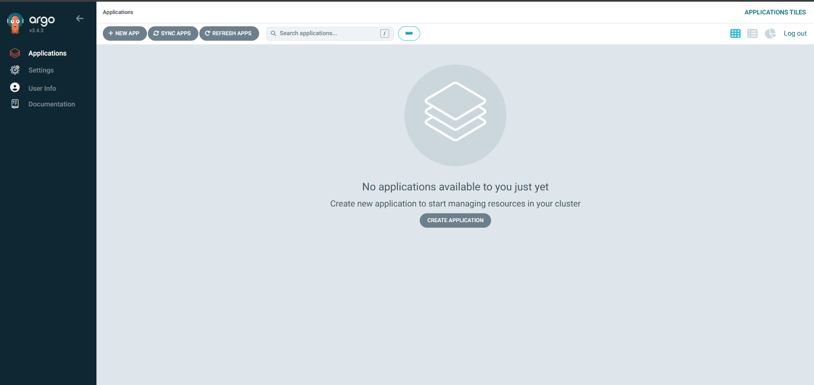

# Tech Challenge 2

## Objective
Deploy a web application using **Docker**, orchestrate it with **AWS EKS**, and set up a **continuous deployment pipeline** using **Jenkins**.

## Tools Used
- **Node.js / Express** — simple web application serving "Hello, World!"
- **Docker** — containerizing the application and its dependencies
- **Amazon ECR** — storing and versioning Docker images
- **Terraform** — provisioning AWS infrastructure (EKS cluster, VPC, IAM roles)
- **AWS EKS** — orchestrating containers using Kubernetes with EC2 nodes
- **Helm** — packaging and deploying the application to Kubernetes
- **Jenkins** — CI/CD pipeline for building, pushing, and deploying the application
- **kubectl** — interacting with the EKS cluster from Jenkins
- **HPA (Horizontal Pod Autoscaler)** — scaling pods based on CPU/memory utilization
- **GitHub** — version control and webhook integration with Jenkins
- **GitHub Actions** — GitOps bonus CI pipeline (build + push to ECR)
- **ArgoCD** — GitOps bonus CD, syncing Helm charts to EKS automatically

## Prerequisites

Before getting started, ensure you have the following installed and configured:

- [AWS CLI](https://docs.aws.amazon.com/cli/latest/userguide/install-cliv2.html) — configured with `aws configure`
- [Terraform](https://developer.hashicorp.com/terraform/install) — v1.0+
- [Docker](https://docs.docker.com/get-docker/)
- [kubectl](https://kubernetes.io/docs/tasks/tools/)
- [Helm](https://helm.sh/docs/intro/install/)
- [Node.js & npm](https://nodejs.org/)
- An AWS account with appropriate IAM permissions
- A GitHub account with a personal access token

## Getting Started

Clone the repository and navigate into it:

```
git clone https://github.com/dejourford/aws_coding_challenge_2.git
cd aws_coding_challenge_2
```

## Procedure

### Phase 1 - Run the Web Application Locally

Step 1.1 - Navigate into the backend directory and install dependencies

```
cd backend
npm install
```

Step 1.2 - Run the web application

```
node index.js
```

Step 1.3 - Navigate to `http://localhost:3000` to verify "Hello, World!" is displayed


### Phase 2 - Containerize the Application with Docker

Step 2.1 - Build the Docker image from the backend directory

```
docker build -t backend-app .
```

Step 2.2 - Run the container

```
docker run -d --name backend -p 3000:3000 backend-app
```

Step 2.3 - Navigate to `http://localhost:3000` to verify the containerized app is working


### Phase 3 - Provision Infrastructure with Terraform

Step 3.1 - Navigate into the terraform directory

```
cd terraform
```

Step 3.2 - Update `variables.tf` with your values

```hcl
variable "project_name" { default = "<your-project-name>" }
variable "region"       { default = "<your-region>" }
variable "key_name"     { default = "<your-key-pair-name>" }
```

Step 3.3 - Initialize and apply Terraform

```
terraform init
terraform apply
```

Step 3.4 - Note the outputs — you will need these in later steps

```
terraform output
```


### Phase 4 - Push Docker Image to ECR

Step 4.1 - Authenticate Docker to ECR

```
aws ecr get-login-password --region <your-region> | docker login --username AWS --password-stdin <your-account-id>.dkr.ecr.<your-region>.amazonaws.com
```

Step 4.2 - Tag your Docker image

```
docker tag backend-app:latest <your-account-id>.dkr.ecr.<your-region>.amazonaws.com/<your-ecr-repo-name>:latest
```

Step 4.3 - Push Docker image to ECR

```
docker push <your-account-id>.dkr.ecr.<your-region>.amazonaws.com/<your-ecr-repo-name>:latest
```


### Phase 5 - Deploy to EKS

Step 5.1 - Configure kubectl to connect to the EKS cluster

```
aws eks update-kubeconfig --region <your-region> --name <your-cluster-name>
```

Step 5.2 - Verify the nodes are ready

```
kubectl get nodes
```

Step 5.3 - Apply the Kubernetes manifests

```
kubectl apply -f k8s/deployment.yaml
kubectl apply -f k8s/service.yaml
kubectl apply -f k8s/hpa.yaml
```

Step 5.4 - Verify everything is running

```
kubectl get pods
kubectl get services
kubectl get hpa
```

Step 5.5 - Navigate to `http://<your-loadbalancer-external-ip>` to verify the application is running


### Phase 6 - Set up Jenkins CI/CD Pipeline

Step 6.1 - Apply the Jenkins Terraform configuration

```
terraform apply
```

Step 6.2 - Navigate to `http://<your-jenkins-ip>:8080`

Step 6.3 - SSH into the Jenkins EC2 to get the initial admin password

```
ssh -i ~/.ssh/<your-key-pair>.pem ec2-user@<your-jenkins-ip>
sudo cat /var/lib/jenkins/secrets/initialAdminPassword
```

Step 6.4 - Install plugins via Manage Jenkins → Plugins → Available Plugins
- Docker
- Amazon EC2
- Amazon Elastic Container Service (ECS) / Fargate
- Kubernetes
- Kubernetes CLI

Step 6.5 - Add credentials via Manage Jenkins → Credentials → System → Global → Add Credentials
- GitHub PAT (Kind: Username with password, ID: `github_pat`)
- AWS Credentials (Kind: AWS Credentials, ID: `aws_keys`)

Step 6.6 - Install AWS CLI, kubectl, and Helm on the Jenkins EC2

```
sudo dnf install awscli -y

curl -LO "https://dl.k8s.io/release/$(curl -L -s https://dl.k8s.io/release/stable.txt)/bin/linux/amd64/kubectl"
chmod +x kubectl && sudo mv kubectl /usr/local/bin/

curl https://raw.githubusercontent.com/helm/helm/main/scripts/get-helm-3 | bash
```

Step 6.7 - Configure AWS credentials and kubectl on the Jenkins EC2

```
aws configure
aws eks update-kubeconfig --region <your-region> --name <your-cluster-name>
```

Step 6.8 - Update the Jenkinsfile environment variables with your values

```groovy
environment {
    AWS_REGION   = '<your-region>'
    ECR_REPO     = '<your-account-id>.dkr.ecr.<your-region>.amazonaws.com/<your-ecr-repo-name>'
    CLUSTER_NAME = '<your-cluster-name>'
}
```

Step 6.9 - Set up the Jenkins Pipeline
- Jenkins home → New Item → name it → Pipeline → OK
- Triggers → select **GitHub hook trigger for GITScm polling**
- Pipeline → Definition = **Pipeline from SCM** → SCM = **Git**
- Enter repo URL, select GitHub PAT credentials, Branch: `*/main`
- Save

Step 6.10 - Set up GitHub Webhook
- GitHub repo → Settings → Webhooks → Add webhook
- Payload URL: `http://<your-jenkins-ip>:8080/github-webhook/`
- Content Type: `application/json`
- Click Add webhook

Step 6.11 - Click **Build Now** in Jenkins to trigger the initial build

Step 6.12 - After a successful build, navigate to `http://<your-loadbalancer-external-ip>` to verify the application

### Phase 7 - Set up GitOps with GitHub Actions and ArgoCD

> **Note:** The GitOps workflow lives on the `gitops` branch. Switch to it before proceeding.

```
git checkout gitops
```

Step 7.1 - Update `.github/workflows/deploy.yml` with your values

```yaml
env:
  AWS_REGION:   <your-region>
  ECR_REPO:     <your-account-id>.dkr.ecr.<your-region>.amazonaws.com/<your-ecr-repo-name>
  CLUSTER_NAME: <your-cluster-name>

# Also update:
role-to-assume: arn:aws:iam::<your-account-id>:role/<your-oidc-role-name>
```

Step 7.2 - Set up OIDC provider in AWS
- IAM → Identity providers → Add provider
- Provider type: OpenID Connect
- Provider URL: `https://token.actions.githubusercontent.com`
- Audience: `sts.amazonaws.com`

Step 7.3 - Create IAM role for GitHub Actions
- IAM → Roles → Create role → Trusted entity: Web identity
- Identity provider: `token.actions.githubusercontent.com`
- GitHub organization: your GitHub username
- GitHub repository: `<your-repo-name>`
- GitHub branch: `gitops`
- Attach policies: `AmazonEC2ContainerRegistryPowerUser`, `AmazonEKSClusterPolicy`, `AmazonEKSWorkerNodePolicy`
- Name the role and update `deploy.yml` with the role ARN

Step 7.4 - Push to the gitops branch to trigger the workflow

```
git add .
git commit -m "update deploy.yml with your values"
git push origin gitops
```

Step 7.5 - Install ArgoCD on the EKS cluster

```
kubectl create namespace argocd
kubectl apply -n argocd -f https://raw.githubusercontent.com/argoproj/argo-cd/stable/manifests/install.yaml
kubectl get pods -n argocd
```

Step 7.6 - Access the ArgoCD UI

```
kubectl -n argocd get secret argocd-initial-admin-secret -o jsonpath="{.data.password}" | base64 -d
kubectl port-forward svc/argocd-server -n argocd 8080:443
```

Navigate to `https://localhost:8080` and log in with username `admin`.



Step 7.7 - Create an ArgoCD application
- Click **New App**
- Application Name: `backend`, Project: `default`, Sync Policy: `Automatic`
- Source: Repository URL: `https://github.com/<your-username>/<your-repo>`, Revision: `gitops`, Path: `helm/backend`
- Destination: Cluster URL: `https://kubernetes.default.svc`, Namespace: `default`
- Click **Create** then **Sync**

Step 7.8 - Verify the deployment

```
kubectl get pods
kubectl get services
```

Step 7.9 - Navigate to `http://<your-loadbalancer-external-ip>` to confirm "Hello, World!" is displaying


## Conclusion
This project successfully demonstrated a full end-to-end DevOps workflow by deploying a containerized Node.js application to AWS EKS using industry-standard tools and practices. Starting from a simple "Hello, World!" Express application, the project covered containerization with Docker, infrastructure provisioning with Terraform, container orchestration with Kubernetes, and automated deployments through two separate CI/CD approaches — Jenkins on the main branch and a GitOps workflow using GitHub Actions and ArgoCD on the gitops branch. The application was made highly available and scalable through EKS node auto-scaling and Horizontal Pod Autoscaling based on CPU and memory utilization.

## Lessons Learned
- **Kubernetes requires more configuration than ECS** — Unlike ECS with Fargate, EKS requires managing node groups, IAM roles, subnet tags, and kubectl access separately. The additional complexity comes with greater flexibility and control.
- **Helm simplifies Kubernetes deployments** — Managing raw YAML manifests becomes difficult at scale. Helm charts allow you to template and reuse deployment configurations across environments.
- **ArgoCD and Jenkins serve different purposes** — Jenkins handles the full CI/CD pipeline while ArgoCD focuses purely on the CD side using a GitOps approach. Both are valid and are often used together in production.
- **Node capacity planning matters** — Running ArgoCD alongside the application exhausted the single node's pod capacity, requiring a second node to be provisioned. Resource planning is critical in real deployments.
- **IAM permissions are granular in EKS** — Connecting kubectl and GitHub Actions to EKS required specific access entries and IAM role configurations that differ from standard AWS IAM patterns.
- **user_data scripts eliminate manual server setup** — Pre-installing Jenkins, Docker, and Java via user_data ensured the Jenkins EC2 was ready on boot without manual intervention.
